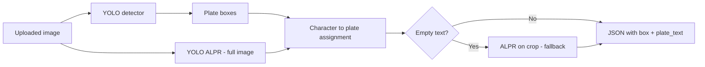

# Brazilian License Plate Recognition API

A **FastAPI** REST service that **locates** Brazilian **Mercosul** license plates in an image and **reads the alphanumeric text** for each plate. It combines two trained **YOLOv8** models—a plate detector and a character-recognition (ALPR) model—behind a single inference endpoint.

Designed for **container** deployment (Docker, Render, Hugging Face Spaces, Kubernetes) and straightforward integration with web or mobile clients.

---

## Overview

| Layer | Role | Artifact |
|--------|------|----------|
| **Detection** | Finds one or more plates (bounding boxes + confidence) | `plate_detector_v1/weights/best.pt` |
| **Reading (ALPR)** | Detects characters (0–9, A–Z), assigns them to a plate, and builds the string | `license_plate_alpr/weights/best.pt` |

Reading first runs ALPR on the **full image** with **exclusive** character-to-plate assignment (expanded boxes; tie-break by distance to the plate center). If a plate still has no text, an optional **fallback** runs a second inference on that plate’s **crop** only.



---

## Features

- **Mercosul plate detection** with pixel boxes and normalized coordinates (`0–1`).
- **YOLO-based OCR**: per-plate text (`plate_text`) and mean character confidence (`plate_text_confidence`).
- **Multiple plates** in one image: one `detections` entry per plate.
- **Optional annotated image** (`return_image=true`): Base64 PNG with labels.
- **Interactive docs**: OpenAPI at `/docs`, ReDoc at `/redoc`.
- **Health check** reporting both weight files (detector + ALPR).
- **CPU-friendly**: PyTorch CPU + Ultralytics stack per `requirements.txt`.

---

## Requirements

- Python **3.10+** (**3.11** recommended, as in Docker).
- Detector weights at `plate_detector_v1/weights/best.pt` (or another `.pt` in that folder).
- ALPR weights at `license_plate_alpr/weights/best.pt` (or another `.pt` in that folder).

---

## Quick start

```bash
git clone https://github.com/sidnei-almeida/brazilian-license-plate-recognition.git
cd brazilian-license-plate-recognition
python -m venv .venv
source .venv/bin/activate   # Windows: .venv\Scripts\activate
pip install -r requirements.txt
python setup.py             # validates environment and starts Uvicorn
```

By default the server listens on `http://127.0.0.1:8000`. Set **`PORT`** to change the listen port (common on PaaS).

**cURL example**

```bash
curl -s -X POST "http://127.0.0.1:8000/v1/detect?return_image=false" \
  -H "Accept: application/json" \
  -F "file=@images/your_photo.jpg" | jq .
```

---

## Repository layout

```
.
├── app.py                          # FastAPI application
├── Dockerfile
├── render.yaml                     # Example Render Web Service
├── requirements.txt
├── packages.txt                    # apt package mirror (reference)
├── setup.py                        # Helper to run the server
├── plate_detector_v1/
│   └── weights/best.pt             # Plate detector (YOLOv8)
├── license_plate_alpr/
│   └── weights/best.pt             # Character / ALPR model (YOLOv8)
├── plate_detector_v1_summary.json
├── images/                         # Sample images / local tests
└── notebooks/                      # Training notebooks (reference)
```

---

## Environment variables

| Variable | Description | Default |
|----------|-------------|---------|
| `MODEL_WEIGHTS_PATH` | Absolute path to the **detector** `.pt` | `plate_detector_v1/weights/best.pt` (relative to project root) |
| `ALPR_WEIGHTS_PATH` | Absolute path to the **ALPR** `.pt` | `license_plate_alpr/weights/best.pt` |
| `PORT` | HTTP port for Uvicorn | `8000` |

The repo **Dockerfile** sets `MODEL_WEIGHTS_PATH` and `ALPR_WEIGHTS_PATH` under `/code/...` inside the image.

---

## API

### Endpoints

| Method | Path | Description |
|--------|------|-------------|
| `GET` | `/` | Welcome message and links to docs and health |
| `GET` | `/health` | Service readiness and availability of **both** models |
| `GET` | `/model/info` | Detector training metrics (`plate_detector_v1_summary.json`) |
| `GET` | `/samples` | Example image URLs (GitHub-hosted) |
| `POST` | `/v1/detect` | Plate detection + reading |

### `POST /v1/detect`

- **Content-Type:** `multipart/form-data`
- **File field:** `file` (PNG or JPEG)

#### Query parameters

**Detector (plates)**

| Parameter | Type | Default | Range | Description |
|-----------|------|---------|-------|-------------|
| `confidence` | float | `0.25` | 0.01–0.99 | YOLO detector confidence threshold |
| `iou` | float | `0.5` | 0.05–0.95 | Detector NMS IoU |
| `image_size` | int | `768` | 320–1280 | Square input size for the detector |
| `return_image` | bool | `false` | — | If `true`, returns Base64 annotated PNG |

**Reading (ALPR)**

| Parameter | Type | Default | Range | Description |
|-----------|------|---------|-------|-------------|
| `read_plate` | bool | `true` | — | If `false`, detection only (no ALPR) |
| `alpr_confidence` | float | `0.25` | 0.01–0.99 | Character YOLO confidence threshold |
| `alpr_iou` | float | `0.5` | 0.05–0.95 | ALPR NMS IoU |
| `alpr_image_size` | int | `640` | 320–1280 | ALPR input size |
| `alpr_box_padding` | float | `0.12` | 0.0–0.45 | Relative box expansion when assigning characters to plates |
| `alpr_crop_fallback` | bool | `true` | — | Second ALPR pass on the crop if the plate has no text |

### Response (`200 OK`)

Each `detections` item includes plate geometry and, when available, the read text.

```json
{
  "detections": [
    {
      "id": 0,
      "class_id": 0,
      "class_name": "placa",
      "confidence": 0.91,
      "box": {
        "xmin": 127,
        "ymin": 187,
        "xmax": 174,
        "ymax": 208,
        "width": 47,
        "height": 21,
        "xmin_norm": 0.397,
        "ymin_norm": 0.586,
        "xmax_norm": 0.543,
        "ymax_norm": 0.651
      },
      "plate_text": "ABC1D23",
      "plate_text_confidence": 0.72
    }
  ],
  "image": {
    "width": 640,
    "height": 480,
    "mode": "RGB"
  },
  "performance": {
    "inference_time_ms": 620.5,
    "model_name": "best.pt",
    "framework_version": "8.x.x",
    "detector_inference_time_ms": 520.0,
    "alpr_inference_time_ms": 100.5,
    "alpr_model_name": "license_plate_alpr/weights/best.pt"
  },
  "annotated_image_base64": null
}
```

- `inference_time_ms`: total request time (detector + ALPR, including crop fallbacks when used).
- `plate_text` / `plate_text_confidence`: may be `null` if no valid characters are assigned to that plate.

### `GET /health`

Example body when everything is available:

```json
{
  "status": "ok",
  "model_path": "/path/to/plate_detector_v1/weights/best.pt",
  "weights_available": true,
  "detections_ready": true,
  "alpr_model_path": "/path/to/license_plate_alpr/weights/best.pt",
  "alpr_weights_available": true,
  "alpr_ready": true
}
```

`status` may be `missing-model` if either expected weight file is missing.

---

## Multiple plates and edge cases

- The detector may return **several** boxes in one photo; each becomes one `detections` entry.
- **Distant** plates, **partial occlusion**, or **sticker-like** regions may produce extra boxes or empty reads; clients can filter by area, confidence, or UI rules.
- `plate_text` quality depends on ALPR training, lighting, angle, and resolution.

---

## Docker

```bash
docker build -t br-plate-api .
docker run --rm -p 8000:8000 br-plate-api
```

The image sets `MODEL_WEIGHTS_PATH` and `ALPR_WEIGHTS_PATH` under `/code/`. In production, set `PORT` as required by your orchestrator.

### Render

Connect the repository to a **Web Service** using the `Dockerfile` (or `render.yaml` if applicable). Render injects `PORT` automatically.

---

## Models

| Role | Typical content |
|------|-----------------|
| **Detector** | YOLOv8 focused on Mercosul plate regions |
| **ALPR** | YOLO with character classes (0–9, A–Z); string built left-to-right |

Aggregated detector metrics are exposed via `GET /model/info` from `plate_detector_v1_summary.json`.

---

## Front-end integration

- Use `xmin_norm` … `ymax_norm` to draw overlays at any scale.
- Rank or highlight detections by `confidence` or box area according to your product rules.
- For visual debugging, set `return_image=true` and decode the Base64 payload as a PNG.

---

## License

MIT. See the `LICENSE` file if present in the repository.

---

## Acknowledgements

- [Ultralytics YOLOv8](https://github.com/ultralytics/ultralytics)
- Dataset contributors and curators of Brazilian plate imagery used for training

## Support

- [GitHub Issues](https://github.com/sidnei-almeida/brazilian-license-plate-recognition/issues)
- [LinkedIn — Sidnei Almeida](https://www.linkedin.com/in/saaelmeida93/)
