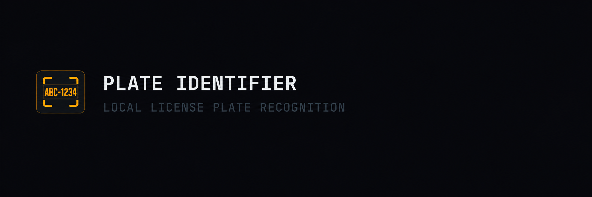
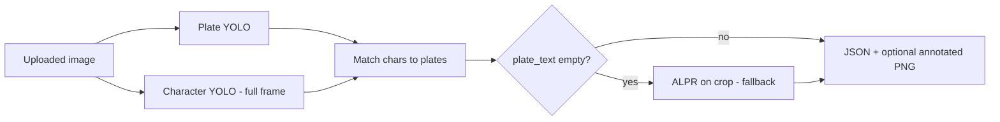

<!-- Canonical repository: https://github.com/sidnei-almeida/brazilian-license-plate-recognition -->
<!-- Hugging Face Spaces: use sdk: docker; see Dockerfile. Frontmatter removed here for clean GitHub rendering. -->
<p align="center">
  
</p>

<h1 align="center">brazilian-license-plate-recognition</h1>

<p align="center">
  <strong>FastAPI service that <em>locates</em> Mercosul-style plates in an image and <em>reads</em> the alphanumeric string—YOLO plate detector + YOLO character model in one HTTP API.</strong>
</p>

<p align="center">
  <a href="https://fastapi.tiangolo.com/" title="FastAPI"></a>
  &nbsp;&nbsp;&nbsp;
  <a href="https://www.python.org/" title="Python"></a>
  &nbsp;&nbsp;&nbsp;
  <a href="https://pytorch.org/" title="PyTorch"></a>
  &nbsp;&nbsp;&nbsp;
  <a href="https://www.ultralytics.com/" title="Ultralytics YOLO"></a>
</p>

<p align="center">
  <a href="https://fastapi.tiangolo.com/"></a>
  
  
  
</p>

<p align="center">
  <a href="#scope-companion-repository">Scope</a> ·
  <a href="#overview">Overview</a> ·
  <a href="#gallery">Gallery</a> ·
  <a href="#features">Features</a> ·
  <a href="#requirements">Requirements</a> ·
  <a href="#installation-and-quick-start">Quick start</a> ·
  <a href="#api-summary">API</a> ·
  <a href="#deployment">Deploy</a> ·
  <a href="#project-layout">Layout</a> ·
  <a href="#environment-variables">Env</a> ·
  <a href="#author">Author</a>
</p>

---

## Scope & companion repository

| **This repo** | **`brazilian-alpr-system`** (separate) |
|----------------|----------------------------------------|
| **Production-oriented API**: finds **plate bounding boxes** in full images and **decodes** Mercosul text with a second YOLO model. | **Research / training** focused on **character-level** detection (digits & letters)—dataset, notebook, and **`best.pt`** for the OCR stage, not this HTTP service. |

> Use **`brazilian-license-plate-recognition`** when you need **where is the plate + what does it say** in one call. Use **`brazilian-alpr-system`** when you work on **character-only** datasets and YOLO training experiments.

---

## Overview

Two **Ultralytics YOLOv8** checkpoints ship with the API:

| Stage | Role | Default weights |
|-------|------|-----------------|
| **Detector** | One or more **plate regions** (Mercosul-oriented training). | `plate_detector_v1/weights/best.pt` |
| **ALPR / characters** | **0–9, A–Z** boxes; assignment + string build per plate (with optional **crop fallback**). | `license_plate_alpr/weights/best.pt` |

Inference runs **detector on the upload**, **ALPR on the full image** with character-to-plate association (expanded boxes + geometry), then optionally a **second ALPR pass on each plate crop** if text is still empty.



---

## Gallery

<p align="center">
  
</p>

<p align="center">
  <em><strong>Figure 1.</strong> End-to-end flow: upload → plate boxes → character decoding → structured response (and optional overlay image).</em>
</p>

---

## Features

| Area | Description |
|------|-------------|
| **Detection** | Pixel and **normalized** box coordinates (`xmin_norm` … `ymax_norm`) for overlays. |
| **Reading** | `plate_text`, `plate_text_confidence`; supports **multiple plates** per image. |
| **Tuning** | Query params for detector and ALPR **confidence**, **IoU**, **input size**, padding, crop fallback. |
| **Debug** | `return_image=true` → Base64 **annotated PNG**. |
| **Ops** | `GET /health` (both weights), `GET /model/info` (detector metrics JSON), `GET /samples` (example image URLs). |

---

## Requirements

| Component | Notes |
|-----------|--------|
| **Python** | **3.10+** (3.11 matches Docker). |
| **Weights** | `plate_detector_v1/weights/best.pt` and `license_plate_alpr/weights/best.pt` (override via env vars). |
| **Runtime** | CPU PyTorch stack per `requirements.txt` (`torch` + `torchvision` from PyTorch CPU index). |

---

## Installation and quick start

```bash
git clone https://github.com/sidnei-almeida/brazilian-license-plate-recognition.git
cd brazilian-license-plate-recognition
python -m venv .venv
source .venv/bin/activate   # Windows: .venv\Scripts\activate
pip install -r requirements.txt
python setup.py               # validates env and starts Uvicorn
```

Default URL: **`http://127.0.0.1:8000`**. Set **`PORT`** for PaaS.

```bash
curl -s -X POST "http://127.0.0.1:8000/v1/detect?return_image=false" \
  -H "Accept: application/json" \
  -F "file=@path/to/image.jpg" | jq .
```

Interactive docs: **`/docs`**, **`/redoc`**.

---

## API summary

| Method | Path | Description |
|--------|------|-------------|
| `GET` | `/` | Welcome + links |
| `GET` | `/health` | Readiness and weight availability |
| `GET` | `/model/info` | Detector metrics from `plate_detector_v1_summary.json` |
| `GET` | `/samples` | Sample image URLs (GitHub raw) |
| `POST` | `/v1/detect` | `multipart/form-data` field **`file`** — detection + optional read |

**Detector (query)**

| Parameter | Default | Description |
|-----------|---------|-------------|
| `confidence` | `0.25` | Plate detector score threshold |
| `iou` | `0.5` | NMS IoU |
| `image_size` | `768` | Square input size (320–1280) |
| `return_image` | `false` | Return Base64 annotated PNG |

**ALPR (query)**

| Parameter | Default | Description |
|-----------|---------|-------------|
| `read_plate` | `true` | Disable to return boxes only |
| `alpr_confidence` | `0.25` | Character detection threshold |
| `alpr_iou` | `0.5` | ALPR NMS IoU |
| `alpr_image_size` | `640` | ALPR input size |
| `alpr_box_padding` | `0.12` | Expand boxes when assigning chars to plates |
| `alpr_crop_fallback` | `true` | Second ALPR pass on crop if text empty |

**Example response** (`200 OK`, abbreviated):

```json
{
  "detections": [
    {
      "id": 0,
      "class_name": "placa",
      "confidence": 0.91,
      "box": { "xmin": 127, "xmin_norm": 0.397, "ymax_norm": 0.651 },
      "plate_text": "ABC1D23",
      "plate_text_confidence": 0.72
    }
  ],
  "image": { "width": 640, "height": 480, "mode": "RGB" },
  "performance": {
    "inference_time_ms": 620.5,
    "detector_inference_time_ms": 520.0,
    "alpr_inference_time_ms": 100.5
  },
  "annotated_image_base64": null
}
```

See **`/docs`** for the full OpenAPI schema, validation ranges, and edge cases (multiple plates, occlusion, empty `plate_text`).

---

## Deployment

```bash
docker build -t br-plate-api .
docker run --rm -p 8000:8000 br-plate-api
```

The **Dockerfile** sets `MODEL_WEIGHTS_PATH` and `ALPR_WEIGHTS_PATH` under `/code/`. For **[Render](https://render.com)**, connect the repo and use **`render.yaml`** or Docker; the platform injects **`PORT`**.

---

## Project layout

```
.
├── app.py
├── setup.py
├── Dockerfile
├── render.yaml
├── requirements.txt
├── images_readme/              # README hero & gallery assets
│   ├── header.png
│   └── software.png
├── plate_detector_v1/
│   └── weights/best.pt
├── license_plate_alpr/
│   └── weights/best.pt
├── plate_detector_v1_summary.json
├── images/                     # Sample / test images for local use
└── notebooks/
    └── 1_YOLOv8_Training_Brazilian_Plates.ipynb
```

---

## Environment variables

| Variable | Description | Default |
|----------|-------------|---------|
| `MODEL_WEIGHTS_PATH` | Path to **plate detector** `.pt` | `plate_detector_v1/weights/best.pt` |
| `ALPR_WEIGHTS_PATH` | Path to **ALPR** `.pt` | `license_plate_alpr/weights/best.pt` |
| `PORT` | HTTP port | `8000` |

---

## Author

| | |
| --- | --- |
| **Maintainer** | [Sidnei Almeida](https://github.com/sidnei-almeida) |
| **Repository** | [github.com/sidnei-almeida/brazilian-license-plate-recognition](https://github.com/sidnei-almeida/brazilian-license-plate-recognition) |
| **Issues** | [GitHub Issues](https://github.com/sidnei-almeida/brazilian-license-plate-recognition/issues) |

---

## License

MIT when a `LICENSE` file is present in the repository; confirm before redistribution.

---

## Acknowledgements

- [Ultralytics YOLOv8](https://github.com/ultralytics/ultralytics)
- Dataset curators and contributors of Brazilian plate imagery used for training

---

<p align="center">
  <sub>For <strong>character-only</strong> research (36-class YOLO, Roboflow notebook, training plots), see <strong>brazilian-alpr-system</strong>.</sub>
</p>
